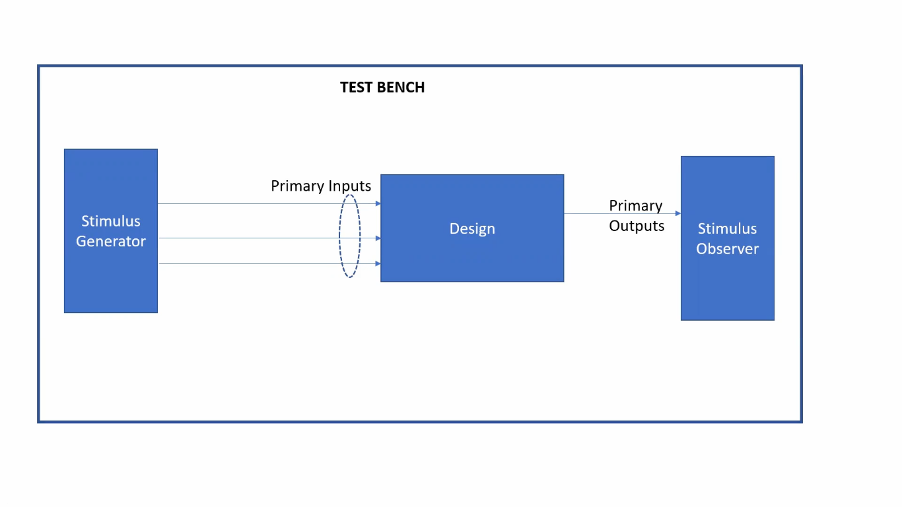
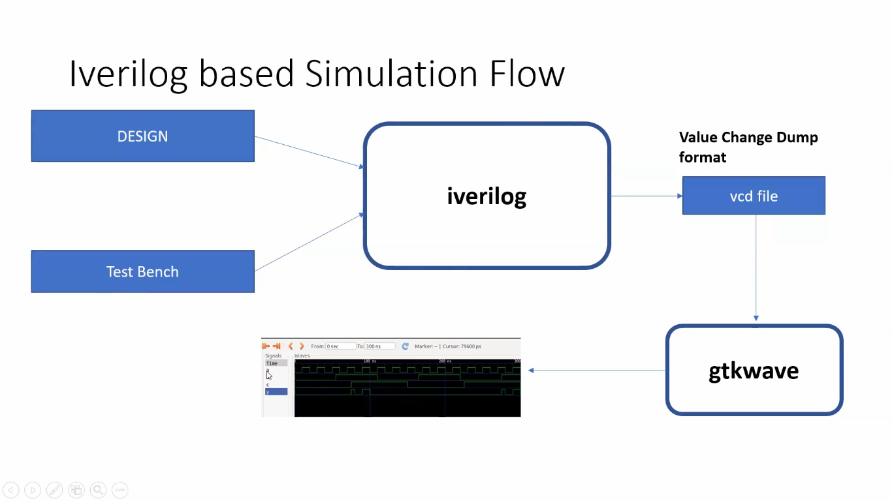

 # learning of week- 1

  # what is a simulator ?
  
 - Simulator is the tool used for simulating the design.
 - iverilog is the tool we use for this program.
   
 # What is testbench ?
 -Test bench  is the setup to apply stimulus(test vectors) to the design to check its functionality

 # How simulator works ?
  - Simulator looks for changes in input signals
  - upon change to the input the output is evaluated , if no change to input ,no change to output

  

  # Iverilog based simulation flow
  
  
