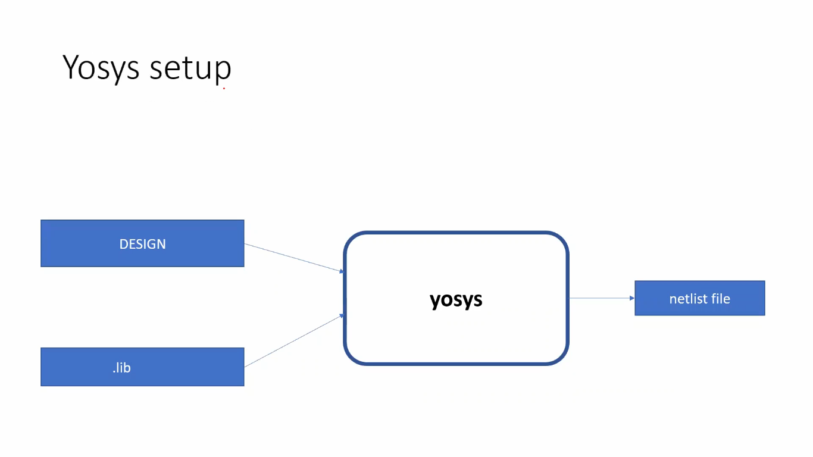
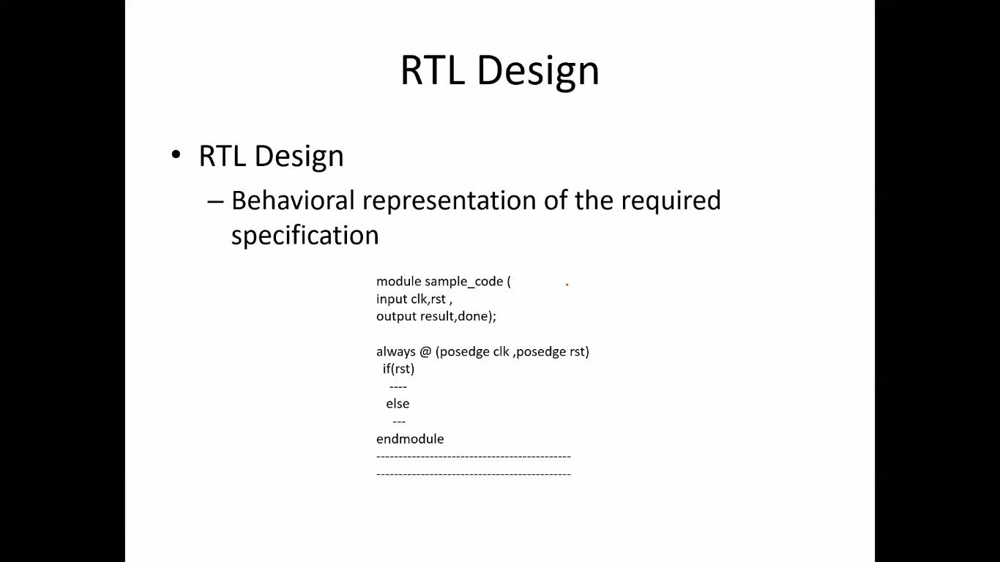
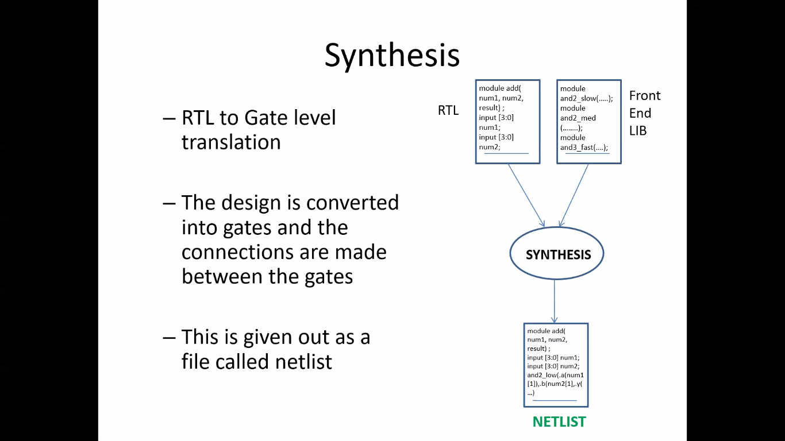
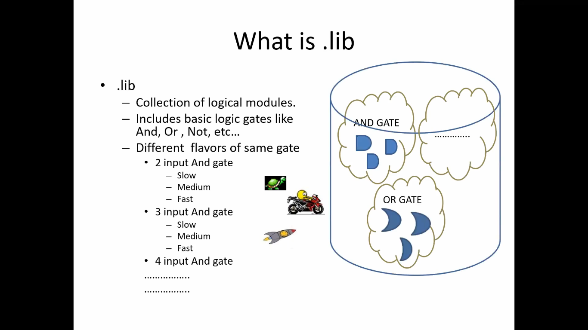

 # learning of week- 1

  # what is a simulator ?
  
 - Simulator is the tool used for simulating the design.
 - iverilog is the tool we use for this program.
   
 # What is testbench ?
 -Test bench  is the setup to apply stimulus(test vectors) to the design to check its functionality

 # How simulator works ?
  - Simulator looks for changes in input signals
  - upon change to the input the output is evaluated , if no change to input ,no change to output

  

  # Iverilog based simulation flow
  
  

  # What is synthesizer ?
   - Tool used for converting RTL to netlist
   - Yosys is the synthesizer used in this course
     
  

  # Structure of RTL

  

  # what does synthesizer do ?
  - RTL to gate level translation
  - The design is converted into gates and the connections are
    made between the gates
  - This is given out as a file called netlist

   

  # What is a .lib file ?
  - collection of logical modules
  - Includes basis logic gates like AND,OR,NOT , etc.
  - Contains different flavors of same gate

  
    
  
  
     
