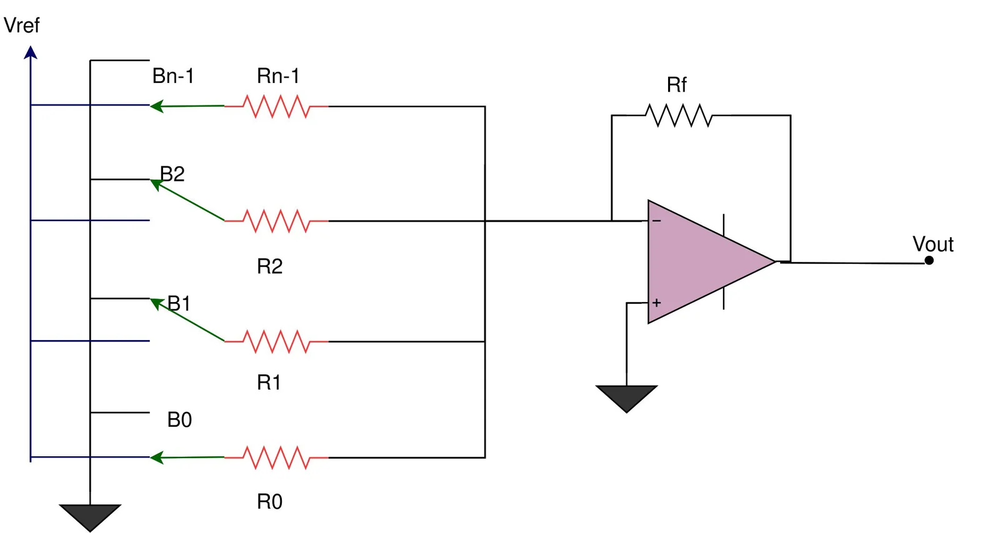

 # 1. What is a System on a chip(SoC) ?
  A **System on a Chip (SoC)** is a complete computer system built on a single chip, integrating multiple components such as CPU,
  GPU, memory, and I/O ports. It is widely used in compact, power-efficient devices like smartphones, tablets, smartwatches,
  and IoT gadgets.

 # Main components 
 
   - **CPU**: Performs main processing and control tasks.
   - **Memory**: Includes RAM for temporary data and Flash/ROM for permanent storage.
   - **I/O Ports**: Enable communication with external devices (USB, camera, etc.).
   - **GPU**: Handles graphics and visuals.
   - **DSP**: Processes audio/video signals efficiently.
   - **Power Management Unit**: Controls energy usage to extend battery life.
   - **Special Features**: Wi-Fi, Bluetooth, and security modules depending on device type.
     
 # Advantages

   - **Compact**: Saves space by combining all components in one chip.
   - **Power Efficient**: Consumes less energy—ideal for portable devices.
   - **High Performance**: Faster data communication within the chip.
   - **Cost Effective**: Cheaper and simpler manufacturing.
   - **Reliable**: Fewer parts mean fewer chances of hardware failure.

 # Applications
   - Used in mobile devices, wearables, IoT devices, smart TVs, vehicles, and appliances.

 # Popular SoCs
   - Apple A-Series, Qualcomm Snapdragon, Samsung Exynos, NVIDIA Tegra.

 # Challenges with SoCs
   - **Complex Design**: Integrating multiple systems on one chip is difficult.
   - **Heat Management**: High component density can cause overheating.
   - **Limited Flexibility**: Hard to modify once manufactured.

# 2.Types of SoCs
  - **Microcontroller-based SoCs**: Designed for simple control tasks with low power use, ideal for home appliances, cars, and IoT devices.
  - **Microprocessor-based SoCs**: Built for complex, multitasking applications that require high processing power, such as smartphones and tablets.
  - **Application-Specific SoCs**: Custom-built for specialized, high-performance tasks like graphics, AI, or networking, optimized for speed and efficiency in  specific functions.

 # SoC design flow

 

 # 3.Introduction to VSDBabySoC

  **VSDBabySoC**is a compact RISC-V-based System on Chip (SoC) designed for testing multiple open-source IP cores and  
  calibrating analog components. It integrates:
   - **RVMYTH CPU**: Handles digital data processing.
   - **Phase-Locked Loop (PLL)**: Generates a stable clock signal to synchronize all components.
   - **10-bit Digital-to-Analog Converter (DAC)**: Converts digital data into analog signals for external devices like  TVs or mobile phones.

 # 1.Initialization & Clock Generation:
   - The PLL activates upon input, producing a synchronized clock to coordinate CPU and DAC operations.
   - Ensures data integrity and timing accuracy.

 # 2.Data Processing (RVMYTH CPU):
   - Uses its registers (e.g., r17) to cycle through digital values for the DAC.
   - Generates continuous digital streams for analog conversion.

 # 3.Analog Signal Generation (DAC):
   - Converts digital values from RVMYTH into analog outputs.
   - Interfaces with consumer electronics to produce sound or video.

 

 # Phase-Locked Loop (PLL)
 A Phase-Locked Loop (PLL) is an electronic control system that generates an output signal whose phase is aligned (locked) to an input reference signal. Essentially, it ensures that the output “follows” the input in frequency and phase.

In VSDBabySoC, the PLL provides a stable clock signal for synchronizing the RVMYTH CPU and DAC, ensuring proper timing across the system.

 # Block diagram

 

 # Key Components of a PLL
  # 1.Phase detector
   - Compares the phase of the input reference signal with the phase of the output signal.
   - Produces an error signal proportional to the phase difference.
  # 2.Loop filter(LF)
   - Usually a low-pass filter.
   - Smooths the error signal from the phase detector to produce a control voltage.
   - Eliminates high-frequency noise to ensure stable operation.
  # 3.Voltage-Controlled Oscillator (VCO)
   - Generates a periodic output signal (clock) whose frequency depends on the control voltage from the loop filter.
   - Adjusts its frequency until it matches the reference signal frequency and phase.
  # 4.Optional Frequency Divider
   - Used in the feedback loop to scale the frequency (e.g., multiply or divide by a factor).
   - Allows the PLL to generate different clock frequencies from the same reference.
     
 # How a PLL Works 
   - The input reference clock is compared with the PLL output in the phase detector.
   - If there’s a phase difference, the PD generates an error signal.
   - The loop filter smooths this signal and feeds it to the VCO.
   - The VCO adjusts its frequency based on the control voltage.
   - The system stabilizes when the output is locked in phase and frequency with the input.
 # Why PLLs Are Needed
   - **Clock Synchronization**: Ensures all parts of a chip operate in sync.
   - **Frequency Generation**: Can produce higher or lower frequencies than the input reference.
   - **Jitter Reduction**: Stabilizes clock signals by filtering out timing variations.
   - **Multiple Clock Domains**: Supports different blocks needing different clock frequencies.
 # Challenges with Off-Chip Clocks
   - **1.Clock Distribution Delays**: Long wires on a chip cause signal delays.
   - **2.Clock Jitter**: Variations in timing can affect synchronization.
   - **3.Frequency Requirements**: Different blocks might require different clock speeds.
   - **4.Crystal Frequency Deviations**: Quartz crystals have slight errors (measured in ppm) affected by temperature and aging.
   - PLL solves these problems by generating a precise, stable, and tunable on-chip clock.
     
# Digital-to-Analog Converter (DAC)
  A Digital-to-Analog Converter (DAC) converts digital data (binary numbers) into an analog signal, like voltage or current. In VSDBabySoC, the DAC converts the digital output of the RVMYTH CPU into analog signals for devices such as TVs or speakers.

 # How a DAC Works
  - The digital input (e.g., 10-bit value) represents a number between 0 and 2^10-1 (0–1023).
  - The DAC converts this number into a proportional analog voltage or current.
  - This analog signal can then drive external devices.
 # Structure of a DAC
  - Multiple digital input lines (number of bits determines resolution).
  - A single analog output.

    
    **Weighted resistor DAC**:A weighted resistor DAC is a digital-to-analog converter that uses binary-weighted
        resistors to convert a digital input code into an equivalent analog output voltage or current.
    

    
    **R-2R ladder DAC** :An R-2R ladder DAC (Digital-to-Analog Converter) is a circuit that converts a digital input
      into an analog output using a simple network of only two types of resistors: R and 2R.
    

  # VSDbabySoc project

  # Requirements 
   Ensure you have Icarus Verilog installed for compilation and GTKWave for viewing waveform files. This project assumes a Unix-like environment (macOS/Linux).

  # step by step guide
   clone or setup the directory structure as follows:
       
       VSDBabySoC/
       ├── src/
       │   ├── include/
       │   │   ├── sandpiper.vh
       │   │   └── other header files...
       │   ├── module/
       │   │   ├── vsdbabysoc.v      # Top-level module integrating all components
       │   │   ├── rvmyth.v          # RISC-V core module
       │   │   ├── avsdpll.v         # PLL module
       │   │   ├── avsddac.v         # DAC module
       │   │   └── testbench.v       # Testbench for simulation
       └── output/
       └── compiled_tlv/         # Holds compiled intermediate files if needed

  # cloning the repo
        cd Soc
        git clone https://github.com/manili/VSDBabySoC.git
        cd VSDBabySoC/

  # Steps to stimulate rvmyth
  
    git clone https://github.com/kunalg123/rvmyth/
    cd rvmyth
    iverilog mythcore_test.v tb_mythcore_test.v
    ./a.out
    gtkwave tb_mythcore_test.vcd

  

    
 

 
 
 
